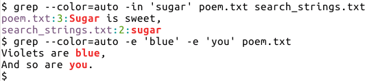
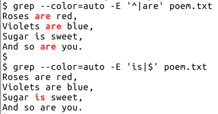

# <a name="gnu-grep"></a>GNU grep

**Table of Contents**

* [Simple string search](#simple-string-search)
* [Case insensitive search](#case-insensitive-search)
* [Invert matching lines](#invert-matching-lines)
* [Line number, count and limiting output lines](#line-number-count-and-limiting-output-lines)
* [Multiple search strings](#multiple-search-strings)
* [File names in output](#file-names-in-output)
* [Match whole word or line](#match-whole-word-or-line)
* [Colored output](#colored-output)
* [Get only matching portion](#get-only-matching-portion)
* [Context matching](#context-matching)
* [Recursive search](#recursive-search)
    * [Basic recursive search](#basic-recursive-search)
    * [Exclude/Include specific files/directories](#excludeinclude-specific-filesdirectories)
    * [Recursive search with bash options](#recursive-search-with-bash-options)
    * [Recursive search using find command](#recursive-search-using-find-command)
    * [Passing file names to other commands](#passing-file-names-to-other-commands)
* [Search strings from file](#search-strings-from-file)
* [Options for scripting purposes](#options-for-scripting-purposes)
* [Regular Expressions - BRE/ERE](#regular-expressions-breere)
    * [Line Anchors](#line-anchors)
    * [Word Anchors](#word-anchors)
    * [Alternation](#alternation)
    * [The dot meta character](#the-dot-meta-character)
    * [Quantifiers](#quantifiers)
    * [Character classes](#character-classes)
    * [Grouping](#grouping)
    * [Back reference](#back-reference)
* [Multiline matching](#multiline-matching)
* [Perl Compatible Regular Expressions](#perl-compatible-regular-expressions)
    * [Backslash sequences](#backslash-sequences)
    * [Non-greedy matching](#non-greedy-matching)
    * [Lookarounds](#lookarounds)
    * [Ignoring specific matches](#ignoring-specific-matches)
    * [Re-using regular expression pattern](#re-using-regular-expression-pattern)
* [Gotchas and Tips](#gotchas-and-tips)
* [Regular Expressions Reference (ERE)](#regular-expressions-reference-ere)
    * [Anchors](#anchors)
    * [Character Quantifiers](#character-quantifiers)
    * [Character classes and backslash sequences](#character-classes-and-backslash-sequences)
    * [Pattern groups](#pattern-groups)
    * [Basic vs Extended Regular Expressions](#basic-vs-extended-regular-expressions)
* [Further Reading](#further-reading)

<br>

```bash
$ grep -V | head -1
grep (GNU grep) 2.25

$ man grep
GREP(1)                     General Commands Manual                    GREP(1)

NAME
       grep, egrep, fgrep, rgrep - print lines matching a pattern

SYNOPSIS
       grep [OPTIONS] PATTERN [FILE...]
       grep [OPTIONS] [-e PATTERN]...  [-f FILE]...  [FILE...]

DESCRIPTION
       grep searches the named input FILEs for lines containing a match to the
       given PATTERN.  If no files are specified, or if the file “-” is given,
       grep  searches  standard  input.   By default, grep prints the matching
       lines.

       In addition, the variant programs egrep, fgrep and rgrep are  the  same
       as  grep -E,  grep -F,  and  grep -r, respectively.  These variants are
       deprecated, but are provided for backward compatibility.
...
```

**Note** For more detailed documentation and examples, use `info grep`

<br>

## <a name="simple-string-search"></a>Simple string search

* First specify the search pattern (usually enclosed in single quotes) and then the file input
* More than one file can be specified or input given from stdin

```bash
$ cat poem.txt 
Roses are red,
Violets are blue,
Sugar is sweet,
And so are you.

$ grep 'are' poem.txt 
Roses are red,
Violets are blue,
And so are you.

$ grep 'so are' poem.txt 
And so are you.
```

* If search string contains any regular expression meta characters like `^$\.*[]` (covered later), use the `-F` option or `fgrep` if available

```bash
$ echo 'int a[5]' | grep 'a[5]'
$ echo 'int a[5]' | grep -F 'a[5]'
int a[5]
$ echo 'int a[5]' | fgrep 'a[5]'
int a[5]
```

* See [Gotchas and Tips](#gotchas-and-tips) section if you get strange issues

<br>

## <a name="case-insensitive-search"></a>Case insensitive search

```bash
$ grep -i 'rose' poem.txt 
Roses are red,

$ grep -i 'and' poem.txt 
And so are you.
```

<br>

## <a name="invert-matching-lines"></a>Invert matching lines

* Use the `-v` option to get lines other than those matching the search string
* Tip: Look out for other opposite pairs like `-l -L`, `-h -H`, opposites in regular expression, etc

```bash
$ grep -v 'are' poem.txt 
Sugar is sweet,

$ # example for input from stdin
$ seq 5 | grep -v '3'
1
2
4
5
```

<br>

## <a name="line-number-count-and-limiting-output-lines"></a>Line number, count and limiting output lines

* Show line number of matching lines

```bash
$ grep -n 'sweet' poem.txt 
3:Sugar is sweet,
```

* Count number of matching lines

```bash
$ grep -c 'are' poem.txt 
3
```

* Limit number of matching lines

```bash
$ grep -m2 'are' poem.txt 
Roses are red,
Violets are blue,
```

<br>

## <a name="multiple-search-strings"></a>Multiple search strings

* Match any

```bash
$ # search blue or you
$ grep -e 'blue' -e 'you' poem.txt 
Violets are blue,
And so are you.
```

If there are lot of search strings, use a file input

```bash
$ printf 'rose\nsugar\n' > search_strings.txt
$ cat search_strings.txt 
rose
sugar

$ # -f option accepts file input with search terms in separate lines
$ grep -if search_strings.txt poem.txt 
Roses are red,
Sugar is sweet,
```

* Match all

```bash
$ # match line containing both are & And
$ grep 'are' poem.txt | grep 'And'
And so are you.
```

<br>

## <a name="file-names-in-output"></a>File names in output

* `-l` to get files matching the search
* `-L` to get files not matching the search
* `grep` skips the rest of file once a match is found

```bash
$ grep -l 'Rose' poem.txt 
poem.txt

$ grep -L 'are' poem.txt search_strings.txt 
search_strings.txt
```

* Prefix file name to search results
* `-h` is default for single file input, no file name prefix in output
* `-H` is default for multiple file input, file name prefix in output

```bash
$ grep -h 'Rose' poem.txt 
Roses are red,
$ grep -H 'Rose' poem.txt 
poem.txt:Roses are red,

$ # -H is default for multiple file input
$ grep -i 'sugar' poem.txt search_strings.txt 
poem.txt:Sugar is sweet,
search_strings.txt:sugar
$ grep -ih 'sugar' poem.txt search_strings.txt 
Sugar is sweet,
sugar
```

<br>

## <a name="match-whole-word-or-line"></a>Match whole word or line

* Word search using `-w` option
    * word constitutes of alphabets, numbers and underscore character
* For example, this helps to distinguish `par` from `spar`, `part`, etc

```bash
$ printf 'par value\nheir apparent\n' | grep 'par'
par value
heir apparent

$ printf 'par value\nheir apparent\n' | grep -w 'par'
par value

$ printf 'scare\ncart\ncar\nmacaroni\n' | grep -w 'car'
car
```

* Another useful option is `-x` to match only complete line, not anywhere in the line

```bash
$ printf 'see my book list\nmy book\n' | grep 'my book'
see my book list
my book

$ printf 'see my book list\nmy book\n' | grep -x 'my book'
my book

$ printf 'scare\ncart\ncar\nmacaroni\n' | grep -x 'car'
car
```

<br>

## <a name="colored-output"></a>Colored output

* Highlight search strings, line numbers, file name, etc in different colors
    * Depends on color support in terminal being used
* options to `--color` are
    * `auto` when output is redirected (another command, file, etc) the color information won't be passed
    * `always` when output is redirected (another command, file, etc) the color information will also be passed
    * `never` explicitly specify no highlighting

```bash
$ grep --color=auto 'blue' poem.txt 
Violets are blue,
```

* Sample screenshot



* Example to show difference between `auto` and `always`

```bash
$ grep --color=auto 'blue' poem.txt > saved_output.txt
$ cat -v saved_output.txt
Violets are blue,
$ grep --color=always 'blue' poem.txt > saved_output.txt
$ cat -v saved_output.txt
Violets are ^[[01;31m^[[Kblue^[[m^[[K,
```

<br>

## <a name="get-only-matching-portion"></a>Get only matching portion

* The `-o` option to get only matched portion is more useful with regular expressions
* Comes in handy if overall number of matches is required, instead of only line wise

```bash
$ grep -o 'are' poem.txt 
are
are
are

$ # -c only gives count of matching lines
$ grep -c 'e' poem.txt 
4
$ grep -co 'e' poem.txt
4
$ # so need another command to get count of all matches
$ grep -o 'e' poem.txt | wc -l
9
```

<br>

## <a name="context-matching"></a>Context matching

* The `-A`, `-B` and `-C` options are useful to get lines after/before/around matching line respectively

```bash
$ grep -A1 'blue' poem.txt 
Violets are blue,
Sugar is sweet,
$ grep -B1 'blue' poem.txt 
Roses are red,
Violets are blue,
$ grep -C1 'blue' poem.txt 
Roses are red,
Violets are blue,
Sugar is sweet,
```

* If there are multiple non-adjacent matching segments, by default `grep` adds a line `--` to separate them

```bash
$ seq 29 | grep -A1 '3'
3
4
--
13
14
--
23
24
```

* Use `--no-group-separator` option if the separator line is a hindrance, for example feeding the output of `grep` to another program

```bash
$ seq 29 | grep --no-group-separator -A1 '3'
3
4
13
14
23
24
```

* Use `--group-separator` to specify an alternate separator

```bash
$ seq 29 | grep --group-separator='*****' -A1 '3'
3
4
*****
13
14
*****
23
24
```

<br>

## <a name="recursive-search"></a>Recursive search


First let's create some more test files

```bash
$ mkdir -p test_files/hidden_files
$ printf 'Red\nGreen\nBlue\nBlack\nWhite\n' > test_files/colors.txt 
$ printf 'Violet\nIndigo\nBlue\nGreen\nYellow\nOrange\nRed\n' > test_files/vibgyor.txt
$ printf '#!/usr/bin/python3\n\nprint("Hello World")\n' > test_files/hello.py
$ printf 'I like yellow\nWhat about you\n' > test_files/hidden_files/.fav_color.info
```

From `man grep`

```bash
       -r, --recursive
              Read all files  under  each  directory,  recursively,  following
              symbolic  links only if they are on the command line.  Note that
              if  no  file  operand  is  given,  grep  searches  the   working
              directory.  This is equivalent to the -d recurse option.

       -R, --dereference-recursive
              Read  all  files  under each directory, recursively.  Follow all
              symbolic links, unlike -r.
```

<br>

#### <a name="basic-recursive-search"></a>Basic recursive search

* Note that `-H` option automatically activates for multiple file input

```bash
$ # by default, current working directory is searched
$ grep -r 'red'
poem.txt:Roses are red,

$ grep -ri 'red'
poem.txt:Roses are red,
test_files/colors.txt:Red
test_files/vibgyor.txt:Red

$ grep -rin 'red'
poem.txt:1:Roses are red,
test_files/colors.txt:1:Red
test_files/vibgyor.txt:7:Red

$ grep -ril 'red'
poem.txt
test_files/colors.txt
test_files/vibgyor.txt
```

<br>

#### <a name="excludeinclude-specific-filesdirectories"></a>Exclude/Include specific files/directories

* By default, recursive search includes hidden files as well
* They can be excluded by file name or directory name
    * [glob](https://github.com/learnbyexample/Linux_command_line/blob/master/Shell.md#wildcards) patterns can be used
    * for example: `*.[ch]` to specify all files ending with `.c` or `.h`
* The exclusion options can be used multiple times
    * for example: `--exclude='*.txt' --exclude='*.log'` or specified from a file using `--exclude-from=FILE`
* To search only files with specific pattern in their names, use `--include=GLOB`
* **Note:** exclusion/inclusion applies only to basename of file/directory, not the entire path
* To follow all symbolic links (not directly specificied as arguments, but found on recursive search), use `-R` instead of `-r`

```bash
$ grep -ri 'you'
poem.txt:And so are you.
test_files/hidden_files/.fav_color.info:What about you

$ # exclude file names starting with `.` i.e hidden files
$ grep -ri --exclude='.*' 'you'
poem.txt:And so are you.

$ # include only file names ending with `.info`
$ grep -ri --include='*.info' 'you'
test_files/hidden_files/.fav_color.info:What about you

$ # exclude a directory
$ grep -ri --exclude-dir='hidden_files' 'you'
poem.txt:And so are you.

$ # If you are using git(or similar), this would be handy
$ # grep --exclude-dir='.git' -rl 'search pattern'
```

<br>

#### <a name="recursive-search-with-bash-options"></a>Recursive search with bash options

* Using `bash` options `globstar` (for recursion)
    * Other options like `extglob` and `dotglob` come in handy too
    * See [glob](https://github.com/learnbyexample/Linux_command_line/blob/master/Shell.md#wildcards) for more info on these options
* The `-d skip` option tells grep to skip directories instead of trying to treat them as text file to be searched

```bash
$ grep -ril 'yellow'
test_files/hidden_files/.fav_color.info
test_files/vibgyor.txt

$ # recursive search
$ shopt -s globstar
$ grep -d skip -il 'yellow' **/*
test_files/vibgyor.txt

$ # include hidden files as well
$ shopt -s dotglob 
$ grep -d skip -il 'yellow' **/*
test_files/hidden_files/.fav_color.info
test_files/vibgyor.txt

$ # use extended glob patterns
$ shopt -s extglob 
$ # other than poem.txt
$ grep -d skip -il 'red' **/!(poem.txt)
test_files/colors.txt
test_files/vibgyor.txt
$ # other than poem.txt or colors.txt
$ grep -d skip -il 'red' **/!(poem|colors).txt
test_files/vibgyor.txt
```

<br>

#### <a name="recursive-search-using-find-command"></a>Recursive search using find command

* `find` is obviously more versatile
* See also [this guide](./wheres_my_file.md#find) for more examples/tutorials on using `find`

```bash
$ # all files, including hidden ones
$ find -type f -exec grep -il 'red' {} +
./poem.txt
./test_files/colors.txt
./test_files/vibgyor.txt

$ # all files ending with .txt
$ find -type f -name '*.txt' -exec grep -in 'you' {} +
./poem.txt:4:And so are you.

$ # all files not ending with .txt
$ find -type f -not -name '*.txt' -exec grep -in 'you' {} +
./test_files/hidden_files/.fav_color.info:2:What about you
```

<br>

#### <a name="passing-file-names-to-other-commands"></a>Passing file names to other commands

* To pass files filtered to another command, see if the receiving command can differentiate file names by ASCII NUL character
* If so, use the `-Z` so that `grep` output is terminated with NUL character and commands like `xargs` have option `-0` to understand it
* This helps when file names can have characters like space, newline, etc
* Typical use case: Search and replace something in all files matching some pattern, for ex: `grep -rlZ 'PAT1' | xargs -0 sed -i 's/PAT2/REPLACE/g'`

```bash
$ # prompt at end of line not shown for simplicity
$ grep -rlZ 'you' | cat -A
poem.txt^@test_files/hidden_files/.fav_color.info^@

$ # print first column from all lines of all files
$ grep -rlZ 'you' | xargs -0 awk '{print $1}'
Roses
Violets
Sugar
And
I
What
```

* simple example to show filenames with space causing issue if `-Z` is not used

```bash
$ # 'abc xyz.txt' is a file with space in its name
$ grep -ri 'are'
abc xyz.txt:hi how are you
poem.txt:Roses are red,
poem.txt:Violets are blue,
poem.txt:And so are you.
saved_output.txt:Violets are blue,

$ # problem when -Z is not used
$ grep -ril 'are' | xargs grep 'you'
grep: abc: No such file or directory
grep: xyz.txt: No such file or directory
poem.txt:And so are you.

$ # no issues if -Z is used
$ grep -rilZ 'are' | xargs -0 grep 'you'
abc xyz.txt:hi how are you
poem.txt:And so are you.
```

* Example for matching more than one search string anywhere in file

```bash
$ # files containing 'you'
$ grep -rl 'you'
poem.txt
test_files/hidden_files/.fav_color.info

$ # files containing 'you' as well as 'are'
$ grep -rlZ 'you' | xargs -0 grep -l 'are'
poem.txt

$ # files containing 'you' but NOT 'are'
$ grep -rlZ 'you' | xargs -0 grep -L 'are'
test_files/hidden_files/.fav_color.info
```

* another example

```bash
$ grep -rilZ 'red' | xargs -0 grep -il 'blue'
poem.txt
test_files/colors.txt
test_files/vibgyor.txt

$ # note the use of `-Z` for middle command
$ grep -rilZ 'red' | xargs -0 grep -ilZ 'blue' | xargs -0 grep -il 'violet'
poem.txt
test_files/vibgyor.txt
```

<br>

## <a name="search-strings-from-file"></a>Search strings from file

* using file input to specify search terms
* `-F` option will force matching strings literally(no regular expressions)
* See also [Fastest way to find lines of a text file from another larger text file](https://stackoverflow.com/questions/42239179/fastest-way-to-find-lines-of-a-text-file-from-another-larger-text-file-in-bash) - read all answers

```bash
$ grep -if test_files/colors.txt poem.txt 
Roses are red,
Violets are blue,

$ # get common lines between two files
$ grep -Fxf test_files/colors.txt test_files/vibgyor.txt 
Blue
Green
Red

$ # get lines present in vibgyor.txt but not in colors.txt
$ grep -Fvxf test_files/colors.txt test_files/vibgyor.txt 
Violet
Indigo
Yellow
Orange
```

<br>

## <a name="options-for-scripting-purposes"></a>Options for scripting purposes

* In scripts, often it is needed just to know if a pattern matches or not
* The `-q` option doesn't print anything on stdout and exit status is `0` if match is found
    * Check out [this practical script](https://github.com/learnbyexample/command_help/blob/master/ch) using the `-q` option

```bash
$ grep -qi 'rose' poem.txt 
$ echo $?
0
$ grep -qi 'lily' poem.txt 
$ echo $?
1

$ if grep -qi 'rose' poem.txt; then echo 'match found!'; else echo 'match not found'; fi
match found!
$ if grep -qi 'lily' poem.txt; then echo 'match found!'; else echo 'match not found'; fi
match not found
```

* The `-s` option will suppress error messages as well

```bash
$ grep 'rose' file_xyz.txt
grep: file_xyz.txt: No such file or directory
$ grep -s 'rose' file_xyz.txt
$ echo $?
2

$ touch foo.txt
$ chmod -r foo.txt
$ grep 'rose' foo.txt
grep: foo.txt: Permission denied
$ grep -s 'rose' foo.txt
$ echo $?
2
```

<br>

## <a name="regular-expressions-breere"></a>Regular Expressions - BRE/ERE

Before diving into regular expressions, few examples to show default `grep` behavior vs `-F`

```bash
$ # oops, why did it not match?
$ echo 'int a[5]' | grep 'a[5]'

$ # where did that error come from??
$ echo 'int a[5]' | grep 'a['
grep: Invalid regular expression

$ # what is going on???
$ echo 'int a[5]' | grep 'a[5'
grep: Unmatched [ or [^

$ # phew, -F is a life saver
$ echo 'int a[5]' | grep -F 'a[5]'
int a[5]

$ # [ and ] are meta characters, details in following sections
$ echo 'int a[5]' | grep 'a\[5]'
int a[5]
```

* By default, `grep` treats the search pattern as BRE (Basic Regular Expression)
    * `-G` option can be used to specify explicitly that BRE is used
* The `-E` option allows to use ERE (Extended Regular Expression) which in GNU grep's case only differs in how meta characters are used, no difference in regular expression functionalities
* If `-F` option is used, the search string is treated literally
* If available, one can also use `-P` which indicates PCRE (Perl Compatible Regular Expression)

<br>

#### <a name="line-anchors"></a>Line Anchors

* Often, search must match from beginning of line or towards end of line
* For example, an integer variable declaration in `C` will start with optional white-space, the keyword `int`, white-space and then variable(s)
    * This way one can avoid matching declarations inside single line comments as well.
* Similarly, one might want to match a variable at end of statement
* The meta characters for line anchoring are `^` for beginning of line and `$` for end of line

```bash
$ echo 'Fantasy is my favorite genre' > fav.txt
$ echo 'My favorite genre is Fantasy' >> fav.txt
$ cat fav.txt 
Fantasy is my favorite genre
My favorite genre is Fantasy

$ # start of line
$ grep '^Fantasy' fav.txt 
Fantasy is my favorite genre

$ # end of line
$ grep 'Fantasy$' fav.txt 
My favorite genre is Fantasy

$ # without anchors
$ grep 'Fantasy' fav.txt 
Fantasy is my favorite genre
My favorite genre is Fantasy
```

* As the meta characters have special meaning (assuming `-F` option is not used), they have to be escaped using `\` to match literally
* The `\` itself is meta character, so to match it literally, use `\\`
* The line anchors `^` and `$` have special meaning only when they are present at start/end of regular expression

```bash
$ echo '^foo bar$' | grep '^foo'
$ echo '^foo bar$' | grep '\^foo'
^foo bar$
$ echo '^foo bar$' | grep '^^foo'
^foo bar$

$ echo '^foo bar$' | grep 'bar$'
$ echo '^foo bar$' | grep 'bar\$'
^foo bar$
$ echo '^foo bar$' | grep 'bar$$'
^foo bar$

$ echo 'foo $ bar' | grep ' $ '
foo $ bar

$ printf 'foo\cbar' | grep -o '\c'
c
$ printf 'foo\cbar' | grep -o '\\c'
\c
```

<br>

#### <a name="word-anchors"></a>Word Anchors

* The `-w` option works well to match whole words. But what about matching only start or end of words?
* Anchors `\<` and `\>` will match start/end positions of a word
* `\b` can also be used instead of `\<` and `\>` which matches either edge of a word

```bash
$ printf 'spar\npar\npart\napparent\n'
spar
par
part
apparent

$ # words ending with par
$ printf 'spar\npar\npart\napparent\n' | grep 'par\>'
spar
par

$ # words starting with par
$ printf 'spar\npar\npart\napparent\n' | grep '\<par'
par
part
```

* `-w` option is same as specifying both start and end word boundaries

```bash
$ printf 'spar\npar\npart\napparent\n' | grep '\<par\>'
par

$ printf 'spar\npar\npart\napparent\n' | grep '\bpar\b'
par

$ printf 'spar\npar\npart\napparent\n' | grep -w 'par'
par
```

* `\b` has an opposite `\B` which is quite useful too

```bash
$ # string not surrounded by word boundary either side
$ printf 'spar\npar\npart\napparent\n' | grep '\Bpar\B'
apparent

$ # word containing par but not as start of word
$ printf 'spar\npar\npart\napparent\n' | grep '\Bpar'
spar
apparent

$ # word containing par but not as end of word
$ printf 'spar\npar\npart\napparent\n' | grep 'par\B'
part
apparent
```

<br>

#### <a name="alternation"></a>Alternation

* The `|` meta character is similar to using multiple `-e` option
* Each side of `|` is complete regular expression with their own start/end anchors
* How each part of alternation is handled and order of evaluation/output is beyond the scope of this tutorial
    * See [this](http://www.regular-expressions.info/alternation.html) for more info on this topic.
* `|` is one of meta characters that requires different syntax between BRE/ERE

```bash
$ grep 'blue\|you' poem.txt 
Violets are blue,
And so are you.
$ grep -E 'blue|you' poem.txt 
Violets are blue,
And so are you.

$ # extract case-insensitive e or f from anywhere in line
$ echo 'Fantasy is my favorite genre' | grep -Eio 'e|f'
F
f
e
e
e

$ # extract case-insensitive e at end of line, f at start of line
$ echo 'Fantasy is my favorite genre' | grep -Eio 'e$|^f'
F
e
```

* A cool usecase of alternation is using `^` or `$` anchors to highlight searched term as well as display rest of unmatched lines
    * the line anchors will match every input line, even empty lines as they are position markers

```bash
$ grep --color=auto -E '^|are' poem.txt 
Roses are red,
Violets are blue,
Sugar is sweet,
And so are you.

$ grep --color=auto -E 'is|$' poem.txt 
Roses are red,
Violets are blue,
Sugar is sweet,
And so are you.
```

Screenshot for above example:



See also

* [stackoverflow - Grep output with multiple Colors](https://stackoverflow.com/questions/17236005/grep-output-with-multiple-colors)
* [unix.stackexchange - Multicolored Grep](https://unix.stackexchange.com/questions/104350/multicolored-grep)

<br>

#### <a name="the-dot-meta-character"></a>The dot meta character

The `.` meta character matches is used to match any character

```bash
$ # any two characters surrounded by word boundaries
$ echo 'I have 12, he has 132!' | grep -ow '..'
12
he

$ # match three characters from start of line
$ # \t (TAB) is single character here
$ printf 'a\tbcd\n' | grep -o '^...'
a       b

$ # all three character word starting with c
$ echo 'car bat cod cope scat dot abacus' | grep -ow 'c..'
car
cod

$ echo '1 & 2' | grep -o '.'
1
 
&
 
2
```

<br>

#### <a name="quantifiers"></a>Quantifiers

Defines how many times a character (simplified for now) should be matched

* `?` will try to match 0 or 1 time
* For BRE, use `\?`

```bash
$ printf 'late\npale\nfactor\nrare\nact\n'
late
pale
factor
rare
act

$ # match a followed by t, with or without c in between
$ printf 'late\npale\nfactor\nrare\nact\n' | grep -E 'ac?t'
late
factor
act

$ # same as using this alternation
$ printf 'late\npale\nfactor\nrare\nact\n' | grep -E 'at|act'
late
factor
act
```

* `*` will try to match 0 or more times
* There is no upper limit and `*` will try to match as many times as possible

```bash
$ echo 'abbbc' | grep -o 'b*'
bbb

$ # matches 0 or more b only if surrounded by a and c
$ echo 'abc ac adc abbc bbb bc' | grep -o 'ab*c'
abc
ac
abbc

$ # see how it matched everything
$ echo 'car bat cod map scat dot abacus' | grep -o '.*'
car bat cod map scat dot abacus

$ # but here it stops at m
$ echo 'car bat cod map scat dot abacus' | grep -o '.*m'
car bat cod m

$ # stopped at dot, not bat or scat - match as much as possible
$ echo 'car bat cod map scat dot abacus' | grep -o 'c.*t'
car bat cod map scat dot

$ # matching overall expression gets preference
$ echo 'car bat cod map scat dot abacus' | grep -o 'c.*at'
car bat cod map scat

$ # precendence is left to right in case of multiple matches
$ echo 'car bat cod map scat dot abacus' | grep -o 'b.*m'
bat cod m
$ echo 'car bat cod map scat dot abacus' | grep -o 'b.*m*'
bat cod map scat dot abacus
```

* `+` will try to match 1 or more times
* Another meta character that differs in syntax between BRE/ERE

```bash
$ echo 'abbbc' | grep -o 'b\+'
bbb
$ echo 'abbbc' | grep -oE 'b+'
bbb

$ echo 'abc ac adc abbc bbb bc' | grep -oE 'ab+c'
abc
abbc
$ echo 'abc ac adc abbc bbb bc' | grep -o 'ab*c'
abc
ac
abbc
```

* For more precise control on number of times to match, `{}` (`\{\}` for BRE) is useful
* It can take one of four forms, `{n}`, `{n,m}`, `{,m}` and `{n,}`


```bash
$ # {n} - exactly n times
$ echo 'ac abc abbc abbbc' | grep -Eo 'ab{2}c'
abbc

$ # {n,m} - n to m, including both n and m
$ echo 'ac abc abbc abbbc' | grep -Eo 'ab{1,2}c'
abc
abbc

$ # {,m} - 0 to m times
$ echo 'ac abc abbc abbbc' | grep -Eo 'ab{,2}c'
ac
abc
abbc

$ # {n,} - at least n times
$ echo 'ac abc abbc abbbc' | grep -Eo 'ab{2,}c'
abbc
abbbc
```

<br>

#### <a name="character-classes"></a>Character classes

* The meta character pairs `[]` allow to match any of the multiple characters within `[]`
* Meta characters like `^`, `$` have different meaning inside and outside of `[]`
* Simple example first, matching any of the characters within `[]`

```bash
$ echo 'do so in to no on' | grep -ow '[nt]o'
to
no

$ echo 'do so in to no on' | grep -ow '[sot][on]'
so
to
on
```

* Adding a quantifier
* Check out [unix words](https://en.wikipedia.org/wiki/Words_(Unix)) and [sample words file](https://users.cs.duke.edu/~ola/ap/linuxwords)

```bash
$ # words made up of letters o and n, at least 2 letters
$ grep -xE '[on]{2,}' /usr/share/dict/words 
no
non
noon
on

$ # lines containing only digits
$ printf 'cat\nfoo\n123\nbaz\n42\n' | grep -xE '[0123456789]+'
123
42
```

* Character ranges
* Matching any alphabet, number, hexadecimal number etc becomes cumbersome if every character has to be individually specified
* So, there's a shortcut, using `-` to construct a range (has to be specified in ascending order)
* See [ascii codes table](http://ascii.cl/) for reference
    * Note that behavior of range will differ for other character encodings
    * See **Character Classes and Bracket Expressions** as well as **LC_COLLATE under Environment Variables** sections in `info grep` for more detail
* [Matching Numeric Ranges with a Regular Expression](http://www.regular-expressions.info/numericranges.html)

```bash
$ printf 'cat\nfoo\n123\nbaz\n42\n' | grep -xE '[0-9]+'
123
42

$ printf 'cat\nfoo\n123\nbaz\n42\n' | grep -xiE '[a-z]+'
cat
foo
baz

$ # only valid decimal numbers
$ printf '128\n34\nfe32\nfoo1\nbar\n' | grep -xE '[0-9]+'
128
34

$ # only valid octal numbers
$ printf '128\n34\nfe32\nfoo1\nbar\n' | grep -xE '[0-7]+'
34

$ # only valid hexadecimal numbers
$ printf '128\n34\nfe32\nfoo1\nbar\n' | grep -xiE '[0-9a-f]+'
128
34
fe32

$ # numbers between 10-29
$ echo '23 54 12 92' | grep -owE '[12][0-9]'
23
12
```

* Negating character class
* By using `^` as first character inside `[]`, we get inverted character class
    * As pointed out earlier, some meta characters behave differently inside and outside of `[]`

```bash
$ # alphabetic words not starting with c
$ echo '123 core not sink code finish' | grep -owE '[^c][a-z]+'
not
sink
finish

$ # excluding numbers 2,3,4,9
$ # note that 200a 200; etc will also match, usage depends on knowing input
$ echo '2001 2004 2005 2008 2009' | grep -ow '200[^2-49]'
2001
2005
2008

$ # get characters from start of line upto(not including) known identifier
$ echo 'foo=bar; baz=123' | grep -oE '^[^=]+'
foo

$ # get characters at end of line from(not including) known identifier
$ echo 'foo=bar; baz=123' | grep -oE '[^=]+$'
123

$ # get all sequence of characters surrounded by unique identifier
$ echo 'I like "mango" and "guava"' | grep -oE '"[^"]+"'
"mango"
"guava"
```

* Matching meta characters inside `[]`
* Most meta characters like `( ) . + { } | $` don't have special meaning inside `[]` and hence do not require special treatment
* Some combination like `[.` or `=]` cannot be used in this order, as they have special meaning within `[]`
    * See **Character Classes and Bracket Expressions** section in `info grep` for more detail

```bash
$ # to match - it should be first or last character within []
$ echo 'Foo-bar 123-456 42 Co-operate' | grep -oiwE '[a-z-]+'
Foo-bar
Co-operate

$ # to match ] it should be first character within []
$ printf 'int a[5]\nfoo=bar\n' | grep '[]=]'
int a[5]
foo=bar

$ # to match [ use [ anywhere in the character list
$ # [][] will match both [ and ]
$ printf 'int a[5]\nfoo=bar\n' | grep '[[]'
int a[5]

$ # to match ^ it should be other than first in the list
$ echo '(a+b)^2 = a^2 + b^2 + 2ab' | grep -owE '[a-z^0-9]{3,}'
a^2
b^2
2ab
```

* Named character classes
* Equivalent class shown is for C locale and ASCII character encoding
    * See [ascii codes table](http://ascii.cl/) for reference
* See **Character Classes and Bracket Expressions** section in `info grep` for more detail

| Character classes | Description |
| ------------- | ----------- |
| [:digit:] | Same as [0-9] |
| [:lower:] | Same as [a-z] |
| [:upper:] | Same as [A-Z] |
| [:alpha:] | Same as [a-zA-Z] |
| [:alnum:] | Same as [0-9a-zA-Z] |
| [:xdigit:] | Same as [0-9a-fA-F] |
| [:cntrl:] | Control characters - first 32 ASCII characters and 127th (DEL) |
| [:punct:] | All the punctuation characters |
| [:graph:] | [:alnum:] and [:punct:] |
| [:print:] | [:alnum:], [:punct:] and space |
| [:blank:] | Space and tab characters |
| [:space:] | white-space characters: tab, newline, vertical tab, form feed, carriage return and space |

```bash
$ printf '128\n34\nAB32\nFoo\nbar\n' | grep -x '[[:alnum:]]*'
128
34
AB32
Foo
bar

$ printf '128\n34\nAB32\nFoo\nbar\n' | grep -x '[[:lower:]]*'
bar

$ printf '128\n34\nAB32\nFoo\nbar\n' | grep -x '[[:lower:]0-9]*'
128
34
bar
```

* backslash character classes
* The **word** `-w` option matches the same set of characters as that of `\w`

| Character classes | Description |
| ------------- | ----------- |
| \w | Same as [0-9a-zA-Z_] or [[:alnum:]_] |
| \W | Same as [^0-9a-zA-Z_] or [^[:alnum:]_] |
| \s | Same as [[:space:]] |
| \S | Same as [^[:space:]] |

```bash
$ printf '123\n$#\ncmp_str\nFoo_bar\n' | grep -x '\w*'
123
cmp_str
Foo_bar
$ printf '123\n$#\ncmp_str\nFoo_bar\n' | grep -x '[[:alnum:]_]*'
123
cmp_str
Foo_bar

$ printf '123\n$#\ncmp_str\nFoo_bar\n' | grep -x '\W*'
$#
$ printf '123\n$#\ncmp_str\nFoo_bar\n' | grep -x '[^[:alnum:]_]*'
$#
```

<br>

#### <a name="grouping"></a>Grouping

* Character classes allow matching against a choice of multiple character list and then quantifier added if needed
* One of the uses of grouping is analogous to character classes for whole regular expressions, instead of just list of characters
* The meta characters `()` are used for grouping
    * requires `\(\)` for BRE
* Similar to maths `ab + ac = a(b+c)`, think of regular expression `a(b|c) = ab|ac`

```bash
$ # 5 letter words starting with c and ending with ty or ly
$ grep -xE 'c..(ty|ly)' /usr/share/dict/words 
catty
coyly
curly

$ # 7 letter words starting with e and ending with rged or sted
$ grep -xE 'e..(rg|st)ed' /usr/share/dict/words 
emerged
existed

$ # repeat a pattern 3 times
$ grep -xE '([a-d][r-z]){3}' /usr/share/dict/words 
avatar
awards
cravat

$ # nesting of () is allowed
$ grep -E '([as](p|c)[r-t]){2}' /usr/share/dict/words
scraps

$ # can be used to match specific columns in well defined tables
$ echo 'foo:123:bar:baz' | grep -E '^([^:]+:){2}bar'
foo:123:bar:baz
```

<br>

#### <a name="back-reference"></a>Back reference

* The matched string within `()` can also be used to be matched again by back referencing the captured groups
* `\1` denotes the first matched group, `\2` the second one and so on
    * Order is leftmost `(` is `\1`, next one is `\2` and so on
* Note that the matched string, not the regular expression itself is referenced
    * for ex: if `([0-9][a-f])` matches `3b`, then back referencing will be `3b` not any other valid match of the regular expression like `8f`, `0a` etc
    * Other regular expressions like PCRE do allow referencing the regular expression itself

```bash
$ # note how first three and last three letters are same
$ grep -xE '([a-d]..)\1' /usr/share/dict/words 
bonbon
cancan
chichi
$ # note how adding quantifier is not same as back-referencing
$ grep -m4 -xE '([a-d]..){2}' /usr/share/dict/words
abacus
abided
abides
ablaze

$ # words with consecutive repeated letters
$ echo 'eel flee all pat ilk seen' | grep -iowE '[a-z]*(.)\1[a-z]*'
eel
flee
all
seen

$ # 17 letter words with first and last as same letter
$ grep -xE '(.)[a-z]{15}\1' /usr/share/dict/words 
semiprofessionals
transcendentalist
```

* **Note** that there is an [issue for certain usage of back-reference and quantifier](https://debbugs.gnu.org/cgi/bugreport.cgi?bug=26864)

```bash
$ # no output
$ grep -m5 -xiE '([a-z]*([a-z])\2[a-z]*){2}' /usr/share/dict/words
$ # works when nesting is unrolled
$ grep -m5 -xiE '[a-z]*([a-z])\1[a-z]*([a-z])\2[a-z]*' /usr/share/dict/words
Abbott
Annabelle
Annette
Appaloosa
Appleseed

$ # no problem if PCRE is used instead of ERE
$ grep -m5 -xiP '([a-z]*([a-z])\2[a-z]*){2}' /usr/share/dict/words
Abbott
Annabelle
Annette
Appaloosa
Appleseed
```

* Useful to spot repeated words
* Use `-z` option (covered later) to match repetition in consecutive lines

```bash
$ cat story.txt 
singing tin in the rain
walking for for a cause
have a nice day
day and night

$ grep -wE '(\w+)\W+\1' story.txt 
walking for for a cause
```

<br>

## <a name="multiline-matching"></a>Multiline matching

* If input is small enough to meet memory requirements, the `-z` option comes in handy to match across multiple lines
* Instead of newline being line separator, the ASCII NUL character is used
    * So, multiline matching depends on whether or not input file itself contains the NUL character
    * Usually text files won't have occasion to use the NUL character and presence of it marks it as binary file for `grep`

```bash
$ # \0 for ASCII NUL character
$ printf 'red\nblue\n\0green\n' | cat -e
red$
blue$
^@green$

$ # see --binary-files=TYPE option in info grep for binary details
$ printf 'red\nblue\n\0green\n' | grep -a 'red'
red

$ # with -z, \0 marks the different 'lines'
$ printf 'red\nblue\n\0green\n' | grep -z 'red'
red
blue

$ # if no \0 in input, entire input read as single string
$ printf 'red\nblue\ngreen\n' | grep -z 'red'
red
blue
green
```

* `\n` is not defined in BRE/ERE
    * see [this](http://unix.stackexchange.com/questions/19491/how-to-specify-characters-using-hexadecimal-codes-in-grep) for a workaround
* if some characteristics of input is known, `[[:space:]]` can be used as workaround, which matches all white-space characters

```bash
$ grep -oz 'Roses.*blue,[[:space:]]' poem.txt 
Roses are red,
Violets are blue,
```

<br>

## <a name="perl-compatible-regular-expressions"></a>Perl Compatible Regular Expressions

```bash
$ # see also: https://github.com/learnbyexample/command_help
$ man grep | sed -n '/^\s*-P/,/^$/p'
       -P, --perl-regexp
              Interpret the pattern as a  Perl-compatible  regular  expression
              (PCRE).   This  is  highly  experimental and grep -P may warn of
              unimplemented features.

```

* The man page informs that `-P` is *highly experimental*. So far, haven't faced any issues. But do keep this in mind.
* Only a few highlights is presented here
* For more info
    * `man pcrepattern` or [read it online](http://www.pcre.org/original/doc/html/pcrepattern.html)
    * [perldoc - re](http://perldoc.perl.org/perlre.html) - Perl regular expression syntax, also links to other related tutorials
    * [regular expression examples on SO documentation](https://stackoverflow.com/documentation/regex/topics)

<br>

#### <a name="backslash-sequences"></a>Backslash sequences

Some of the backslash constructs available in PCRE over already seen ones in ERE

* `\d` for `[0-9]`
* `\s` for `[\ \t\r\n\f]`
* `\h` for `[ \t]`
* `\n` for newline character
* `\D`, `\S`, `\H`, `\N` etc for their opposites

```bash
$ # example for [0-9] in ERE and \d in PCRE
$ echo 'foo=5, bar=3; x=83, y=120' | grep -oE '[0-9]+'
5
3
83
120
$ echo 'foo=5, bar=3; x=83, y=120' | grep -oP '\d+'
5
3
83
120

$ # (?s) allows newlines to be also matches when using . meta character
$ grep -ozP '(?s)Roses.*blue,\n' poem.txt 
Roses are red,
Violets are blue,
```

* See **INTERNAL OPTION SETTING** in `man pcrepattern` for more info on `(?s)`, `(?m)` etc
* [Specifying Modes Inside The Regular Expression](http://www.regular-expressions.info/modifiers.html) also has some detail on such options

<br>

#### <a name="non-greedy-matching"></a>Non-greedy matching

* Both BRE/ERE support only greedy matching quantifiers
    * match as much as possible
* PCRE supports non-greedy version by adding `?` after quantifiers
    * match as minimal as possible
* See [this Python notebook](http://nbviewer.jupyter.org/url/norvig.com/ipython/pal3.ipynb) for an interesting project on palindrome sentences

```bash
$ echo 'foo and bar and baz went shopping bytes' | grep -oi '\w.*and'
foo and bar and

$ echo 'foo and bar and baz went shopping bytes' | grep -oiP '\w.*?and'
foo and
bar and

$ # recall that matching overall expression gets preference
$ echo 'foo and bar and baz went shopping bytes' | grep -oi '\w.*and baz'
foo and bar and baz
$ echo 'foo and bar and baz went shopping bytes' | grep -oiP '\w.*?and baz'
foo and bar and baz

$ # minimal matching with single character has simple workaround
$ echo 'A man, a plan, a canal, Panama' | grep -oi 'a.*,'
A man, a plan, a canal,
$ echo 'A man, a plan, a canal, Panama' | grep -oi 'a[^,]*,'
A man,
a plan,
a canal,
```

<br>

#### <a name="lookarounds"></a>Lookarounds

* Ability to add conditions to match before/after required pattern
* There are four types
    * positive lookahead `(?=`
    * negative lookahead `(?!`
    * positive lookbehind `(?<=`
    * negative lookbehind `(?<!`
* One way to remember is that **behind** uses `<` and **negative** uses `!` instead of `=`
* When used with `-o` option, lookarounds portion won't be part of output

Fixed and variable length *lookbehind*

```bash
$ # extract digits preceded by single lowercase letter and =
$ # this is fixed length lookbehind because length is known
$ echo 'foo=5, bar=3; x=83, y=120' | grep -oP '(?<=\b[a-z]=)\d+'
83
120

$ # error because {2,} induces variable length matching
$ echo 'foo=5, bar=3; x=83, y=120' | grep -oP '(?<=\b[a-z]{2,}=)\d+'
grep: lookbehind assertion is not fixed length

$ # use \K for such cases
$ echo 'foo=5, bar=3; x=83, y=120' | grep -oP '\b[a-z]{2,}=\K\d+'
5
3
```

* Examples for lookarounds

```bash
$ # extract digits that follow =
$ echo 'foo=5, bar=3; x=83, y=120' | grep -oP '=\K\d+'
5
3
83
120

$ # digits that follow = and has , after
$ echo 'foo=5, bar=3; x=83, y=120' | grep -oP '=\K\d+(?=,)'
5
83

$ # extract words, but not those at start of line
$ echo 'car bat cod map' | grep -owP '(?<!^)\w+'
bat
cod
map

$ # extract words, but not those at start of line or end of line
$ echo 'car bat cod map' | grep -owP '(?<!^)\w+(?!$)'
bat
cod
```

<br>

#### <a name="ignoring-specific-matches"></a>Ignoring specific matches

* A useful construct is `(*SKIP)(*F)` which allows to discard matches not needed
* Simple way to use is that regular expression which should be discarded is written first, `(*SKIP)(*F)` is appended and then whichever is required by added after `|`
* See [Excluding Unwanted Matches](http://www.rexegg.com/backtracking-control-verbs.html#skipfail) for more info

```bash
$ # all words except bat and map
$ echo 'car bat cod map' | grep -oP '(bat|map)(*SKIP)(*F)|\w+'
car
cod

$ # all words except those surrounded by double quotes
$ echo 'I like "mango" and "guava"' | grep -oP '"[^"]+"(*SKIP)(*F)|\w+'
I
like
and
```

<br>

#### <a name="re-using-regular-expression-pattern"></a>Re-using regular expression pattern

* `\1`, `\2` etc only matches exact string
* `(?1)`, `(?2)` etc re-uses the regular expression itself

```bash
$ # (?1) refers to first group \d{4}-\d{2}-\d{2}
$ echo '2008-03-24 and 2012-08-12 foo' | grep -oP '(\d{4}-\d{2}-\d{2})\D+(?1)'
2008-03-24 and 2012-08-12
```

<br>

## <a name="gotchas-and-tips"></a>Gotchas and Tips

* Always quote the search string (unless you know what you are doing :P)

```bash
$ grep so are poem.txt 
grep: are: No such file or directory
poem.txt:And so are you.

$ grep 'so are' poem.txt 
And so are you.
```

* Another common problem is unquoted search string will be open to shell's own globbing rules

```bash
$ # sample output on bash shell, might vary for different shells
$ echo '*.txt' | grep -F *.txt
$ echo '*.txt' | grep -F '*.txt'
*.txt
```

* Use double quotes for variable expansion, command substitution, etc (Note: could vary based on shell used)
* See [mywiki.wooledge Quotes](http://mywiki.wooledge.org/Quotes) for detailed discussion of quoting in `bash` shell

```bash
$ # sample output on bash shell, might vary for different shells
$ color='blue'
$ grep "$color" poem.txt 
Violets are blue,
```

* Pattern starting with `-`

```bash
$ # this issue is not specific to grep alone
$ # the command assumes -2 is an option and hence the error
$ echo '5*3-2=13' | grep '-2'
Usage: grep [OPTION]... PATTERN [FILE]...
Try 'grep --help' for more information.

$ # workaround by using \-
$ echo '5*3-2=13' | grep '\-2'
5*3-2=13

$ # or use -- to indicate no further options to process
$ echo '5*3-2=13' | grep -- '-2'
5*3-2=13

$ # same issue with printf
$ printf '-1+2=1\n'
bash: printf: -1: invalid option
printf: usage: printf [-v var] format [arguments]
$ printf -- '-1+2=1\n'
-1+2=1
```

* Tip: Options can be specified at end of command as well, useful if option was forgotten and have to quickly add it to previous command from history

```bash
$ grep 'are' poem.txt 
Roses are red,
Violets are blue,
And so are you.

$ # use previous command from history, for ex up arrow key in bash
$ # then simply add the option at end
$ grep 'are' poem.txt -n
1:Roses are red,
2:Violets are blue,
4:And so are you.
```

* Speed boost if input file is ASCII

```bash
$ time grep -xE '([a-d][r-z]){3}' /usr/share/dict/words
avatar
awards
cravat

real    0m0.145s

$ time LC_ALL=C grep -xE '([a-d][r-z]){3}' /usr/share/dict/words
avatar
awards
cravat

real    0m0.011s
```

* Speed boost by using PCRE for back-references
* might be faster when using quantifiers as well

```bash
$ time LC_ALL=C grep -xE '([a-z]..)\1' /usr/share/dict/words
bonbon
cancan
chichi
murmur
muumuu
pawpaw
pompom
tartar
testes

real    0m0.174s
$ time grep -xP '([a-z]..)\1' /usr/share/dict/words
bonbon
cancan
chichi
murmur
muumuu
pawpaw
pompom
tartar
testes

real    0m0.008s
```

<br>

## <a name="regular-expressions-reference-ere"></a>Regular Expressions Reference (ERE)

<br>

#### <a name="anchors"></a>Anchors

* `^` match from start of line
* `$` match end of line
* `\<` match beginning of word
* `\>` match end of word
* `\b` match edge of word
* `\B` match other than edge of word

<br>

#### <a name="character-quantifiers"></a>Character Quantifiers

* `.` match any single character
* `*` match preceding character/group 0 or more times
* `+` match preceding character/group 1 or more times
* `?` match preceding character/group 0 or 1 times
* `{n}` match preceding character/group exactly n times
* `{n,}` match preceding character/group n or more times
* `{n,m}` match preceding character/group n to m times, including n and m
* `{,m}` match preceding character/group up to m times

<br>

#### <a name="character-classes-and-backslash-sequences"></a>Character classes and backslash sequences

* `[aeiou]` match any of these characters
* `[^aeiou]` do not match any of these characters
* `[a-z]` match any lowercase alphabet
* `[0-9]` match any digit character
* `\w` match alphabets, digits and underscore character, short cut for `[a-zA-Z0-9_]`
* `\W` opposite of `\w` , short cut for `[^a-zA-Z0-9_]`
* `\s` match white-space characters: tab, newline, vertical tab, form feed, carriage return, and space
* `\S` match other than white-space characters

<br>

#### <a name="pattern-groups"></a>Pattern groups

* `|` matches either of the given patterns
* `()` patterns within `()` are grouped and treated as one pattern, useful in conjunction with `|`
* `\1` backreference to first grouped pattern within `()`
* `\2` backreference to second grouped pattern within `()` and so on

<br>

#### <a name="basic-vs-extended-regular-expressions"></a>Basic vs Extended Regular Expressions

By default, the pattern passed to `grep` is treated as Basic Regular Expressions(BRE), which can be overridden using options like `-E` for ERE and `-P` for Perl Compatible Regular Expression(PCRE)  
Paraphrasing from `info grep`

>In Basic Regular Expressions the meta-characters `? + { | ( )` lose their special meaning, instead use the backslashed versions `\? \+ \{ \| \( \)`

<br>

## <a name="further-reading"></a>Further Reading

* `man grep` and `info grep`
    * At least go through all options ;)
    * **Usage section** in `info grep` has good examples as well
* A bit of history
    * [how grep command was born](https://medium.com/@rualthanzauva/grep-was-a-private-command-of-mine-for-quite-a-while-before-i-made-it-public-ken-thompson-a40e24a5ef48)
    * [why GNU grep is fast](https://lists.freebsd.org/pipermail/freebsd-current/2010-August/019310.html)
    * [Difference between grep, egrep and fgrep](https://unix.stackexchange.com/questions/17949/what-is-the-difference-between-grep-egrep-and-fgrep)
* Tutorials and Q&A
    * [grep tutorial](http://www.panix.com/~elflord/unix/grep.html)
    * [grep examples](https://alvinalexander.com/unix/edu/examples/grep.shtml)
    * [grep Q&A on stackoverflow](https://stackoverflow.com/questions/tagged/grep?sort=votes&pageSize=15)
    * [grep Q&A on unix stackexchange](https://unix.stackexchange.com/questions/tagged/grep?sort=votes&pageSize=15)
* Learn Regular Expressions (has information on flavors other than BRE/ERE/PCRE too)
    * [Regular Expressions Tutorial](http://www.regular-expressions.info/tutorial.html)
    * [regexcrossword](https://regexcrossword.com/)
    * [What does this regex mean?](https://stackoverflow.com/questions/22937618/reference-what-does-this-regex-mean)
    * [online regex tester and debugger](https://regex101.com/) - by default `pcre` flavor
* Alternatives
    * [pcregrep](http://www.pcre.org/original/doc/html/pcregrep.html)
    * [ag - silver searcher](https://github.com/ggreer/the_silver_searcher)
    * [ripgrep](https://github.com/BurntSushi/ripgrep)
* [unix.stackexchange - When to use grep, sed, awk, perl, etc](https://unix.stackexchange.com/questions/303044/when-to-use-grep-less-awk-sed)
