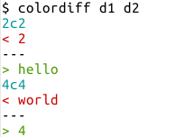
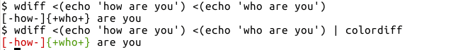

# <a name="whats-the-difference"></a>What's the difference

**Table of Contents**

* [cmp](#cmp)
* [diff](#diff)
    * [Comparing Directories](#comparing-directories)
    * [colordiff](#colordiff)

<br>

## <a name="cmp"></a>cmp

```bash
$ cmp --version | head -n1
cmp (GNU diffutils) 3.3

$ man cmp
CMP(1)                           User Commands                          CMP(1)

NAME
       cmp - compare two files byte by byte

SYNOPSIS
       cmp [OPTION]... FILE1 [FILE2 [SKIP1 [SKIP2]]]

DESCRIPTION
       Compare two files byte by byte.

       The optional SKIP1 and SKIP2 specify the number of bytes to skip at the
       beginning of each file (zero by default).
...
```

* As the comparison is byte by byte, it doesn't matter if file is human readable or not
* A typical use case is to check if two executables are same or not

```bash
$ echo 'foo 123' > f1; echo 'food 123' > f2
$ cmp f1 f2
f1 f2 differ: byte 4, line 1

$ # print differing bytes
$ cmp -b f1 f2
f1 f2 differ: byte 4, line 1 is  40   144 d

$ # skip given bytes from each file
$ # if only one number is given, it is used for both inputs
$ cmp -i 3:4 f1 f2
$ echo $?
0

$ # compare only given number of bytes from start of inputs
$ cmp -n 3 f1 f2
$ echo $?
0

$ # suppress output
$ cmp -s f1 f2
$ echo $?
1
```

* Comparison stops immediately at the first difference found
* If verbose option `-l` is used, comparison would stop at whichever input reaches end of file first

```bash
$ # first column is byte number
$ # second/third column is respective octal value of differing bytes
$ cmp -l f1 f2
4  40 144
5  61  40
6  62  61
7  63  62
8  12  63
cmp: EOF on f1
```

**Further Reading**

* `man cmp` and `info cmp` for more options and detailed documentation


<br>

## <a name="diff"></a>diff

```bash
$ diff --version | head -n1
diff (GNU diffutils) 3.3

$ man diff
DIFF(1)                          User Commands                         DIFF(1)

NAME
       diff - compare files line by line

SYNOPSIS
       diff [OPTION]... FILES

DESCRIPTION
       Compare FILES line by line.
...
```

* `diff` output shows lines from first file input starting with `<`
* lines from second file input starts with `>`
* between the two file contents, `---` is used as separator
* each difference is prefixed by a command that indicates the differences (see links at end of section for more details)

```bash
$ paste d1 d2
1       1
2       hello
3       3
world   4

$ diff d1 d2
2c2
< 2
---
> hello
4c4
< world
---
> 4

$ diff <(seq 4) <(seq 5)
4a5
> 5
```

* use `-i` option to ignore case

```bash
$ echo 'Hello World!' > i1
$ echo 'hello world!' > i2

$ diff i1 i2
1c1
< Hello World!
---
> hello world!

$ diff -i i1 i2
$ echo $?
0
```

* ignoring difference in white spaces

```bash
$ # -b option to ignore changes in the amount of white space
$ diff -b <(echo 'good day') <(echo 'good    day')
$ echo $?
0

$ # -w option to ignore all white spaces
$ diff -w <(echo 'hi    there ') <(echo ' hi there')
$ echo $?
0
$ diff -w <(echo 'hi    there ') <(echo 'hithere')
$ echo $?
0

# use -B to ignore only blank lines
# use -E to ignore changes due to tab expansion
# use -z to ignore trailing white spaces at end of line
```

* side-by-side output

```bash
$ diff -y d1 d2
1                                                               1
2                                                             | hello
3                                                               3
world                                                         | 4

$ # -y is usually used along with other options
$ # default width is 130 print columns
$ diff -W 60 --suppress-common-lines -y d1 d2
2                            |  hello
world                        |  4

$ diff -W 20 --left-column -y <(seq 4) <(seq 5)
1     (
2     (
3     (
4     (
      > 5
```

* by default, there is no output if input files are same. Use `-s` option to additionally indicate files are same
* by default, all differences are shown. Use `-q` option to indicate only that files differ

```bash
$ cp i1 i1_copy
$ diff -s i1 i1_copy
Files i1 and i1_copy are identical
$ diff -s i1 i2
1c1
< Hello World!
---
> hello world!

$ diff -q i1 i1_copy
$ diff -q i1 i2
Files i1 and i2 differ

$ # combine them to always get one line output
$ diff -sq i1 i1_copy
Files i1 and i1_copy are identical
$ diff -sq i1 i2
Files i1 and i2 differ
```

<br>

#### <a name="comparing-directories"></a>Comparing Directories

* when comparing two files of same name from different directories, specifying the filename is optional for one of the directories

```bash
$ mkdir dir1 dir2
$ echo 'Hello World!' > dir1/i1
$ echo 'hello world!' > dir2/i1

$ diff dir1/i1 dir2
1c1
< Hello World!
---
> hello world!

$ diff -s i1 dir1/
Files i1 and dir1/i1 are identical
$ diff -s . dir1/i1
Files ./i1 and dir1/i1 are identical
```

* if both arguments are directories, all files are compared

```bash
$ touch dir1/report.log dir1/lists dir2/power.log
$ cp f1 dir1/
$ cp f1 dir2/

$ # by default, all differences are reported
$ # as well as filenames which are unique to respective directories
$ diff dir1 dir2
diff dir1/i1 dir2/i1
1c1
< Hello World!
---
> hello world!
Only in dir1: lists
Only in dir2: power.log
Only in dir1: report.log
```

* to report only filenames

```bash
$ diff -sq dir1 dir2
Files dir1/f1 and dir2/f1 are identical
Files dir1/i1 and dir2/i1 differ
Only in dir1: lists
Only in dir2: power.log
Only in dir1: report.log

$ # list only differing files
$ # also useful to copy-paste the command for GUI diffs like tkdiff/vimdiff
$ diff dir1 dir2 | grep '^diff '
diff dir1/i1 dir2/i1
```

* to recursively compare sub-directories as well, use `-r`

```bash
$ mkdir dir1/subdir dir2/subdir
$ echo 'good' > dir1/subdir/f1
$ echo 'goad' > dir2/subdir/f1

$ diff -srq dir1 dir2
Files dir1/f1 and dir2/f1 are identical
Files dir1/i1 and dir2/i1 differ
Only in dir1: lists
Only in dir2: power.log
Only in dir1: report.log
Files dir1/subdir/f1 and dir2/subdir/f1 differ

$ diff -r dir1 dir2 | grep '^diff '
diff -r dir1/i1 dir2/i1
diff -r dir1/subdir/f1 dir2/subdir/f1
```

* See also [GNU diffutils manual - comparing directories](https://www.gnu.org/software/diffutils/manual/diffutils.html#Comparing-Directories) for further options and details like excluding files, ignoring filename case, etc and `dirdiff` command

<br>

#### <a name="colordiff"></a>colordiff

```bash
$ whatis colordiff 
colordiff (1)        - a tool to colorize diff output

$ whatis wdiff
wdiff (1)            - display word differences between text files
```

* simply replace `diff` with `colordiff`



* or, pass output of a `diff` tool to `colordiff`



* See also [stackoverflow - How to colorize diff on the command line?](https://stackoverflow.com/questions/8800578/how-to-colorize-diff-on-the-command-line) for other options

<br>

**Further Reading**

* `man diff` and `info diff` for more options and detailed documentation
    * [GNU diffutils manual](https://www.gnu.org/software/diffutils/manual/diffutils.html) for a better documentation
* `man -k diff` to get list of all commands related to `diff`
* [diff Q&A on unix stackexchange](https://unix.stackexchange.com/questions/tagged/diff?sort=votes&pageSize=15)
* [unix.stackexchange - GUI diff and merge tools](https://unix.stackexchange.com/questions/4573/which-gui-diff-viewer-would-you-recommend-with-copy-to-left-right-functionality)
* [unix.stackexchange - Understanding diff output](https://unix.stackexchange.com/questions/81998/understanding-of-diff-output)
* [stackoverflow - Using output of diff to create patch](https://stackoverflow.com/questions/437219/using-the-output-of-diff-to-create-the-patch)

